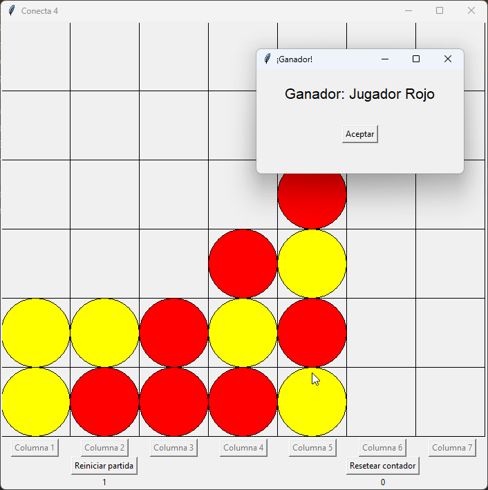

# Proyecto Conecta 4 en Python

Proyecto desarrollado en Python para practicar habilidades de programación y construir un portafolio. La idea del proyecto se obtuvo de [retosdeprogramacion.com](https://retosdeprogramacion.com/proyectos/).

## Descripción del Proyecto

El proyecto consiste en una implementación del juego Conecta 4 en Python. A continuación se detallan los requisitos y el roadmap del proyecto.

### Requisitos del Proyecto

- Tablero de dimensiones 7x6 (7 en el eje "x" y 6 en el "y").
- Fichas Rojas y Amarillas. La primera partida la comienza siempre la ficha Roja (la segunda la Amarilla, la tercera la Roja...).
- Juego para dos personas reales alternándose, sin implementar una funcionalidad para jugar contra la App.
- Al seleccionar la columna se coloca la ficha en la parte inferior.
- Guardar el número de partidas ganadas de cada equipo mientras la App no se finaliza.
- Dos botones para reiniciar la partida en marcha y para resetear el contador de victorias y derrotas.
- Posibilidad de añadir funcionalidades adicionales.

### Roadmap

1. Corrección de bugs (en ocasiones se suma la puntuación del jugador al ganar más de una vez).
2. Mejora de la representación gráfica.
3. Añadir funcionalidades extra como modificar el tamaño del tablero.
4. Incorporación a una web bajo el framework Django.

## Uso del Proyecto

Para jugar, ejecuta el código y sigue las instrucciones en la interfaz gráfica.

## Contribuciones

Las contribuciones son bienvenidas. Si encuentras algún bug o tienes ideas para mejorar el juego, ¡no dudes en colaborar!

## Licencia

Este proyecto se encuentra bajo la licencia [MIT](LICENSE).

